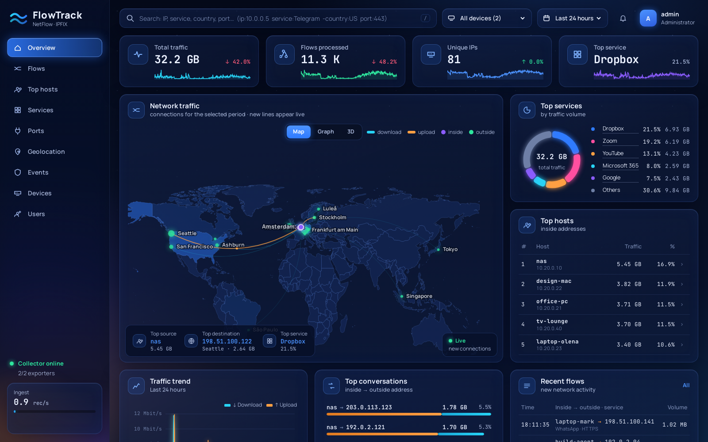
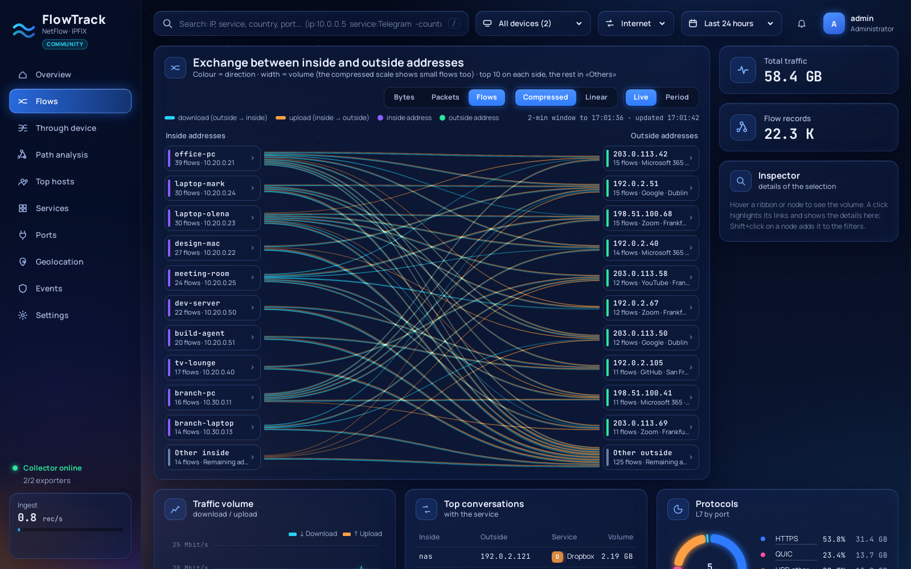
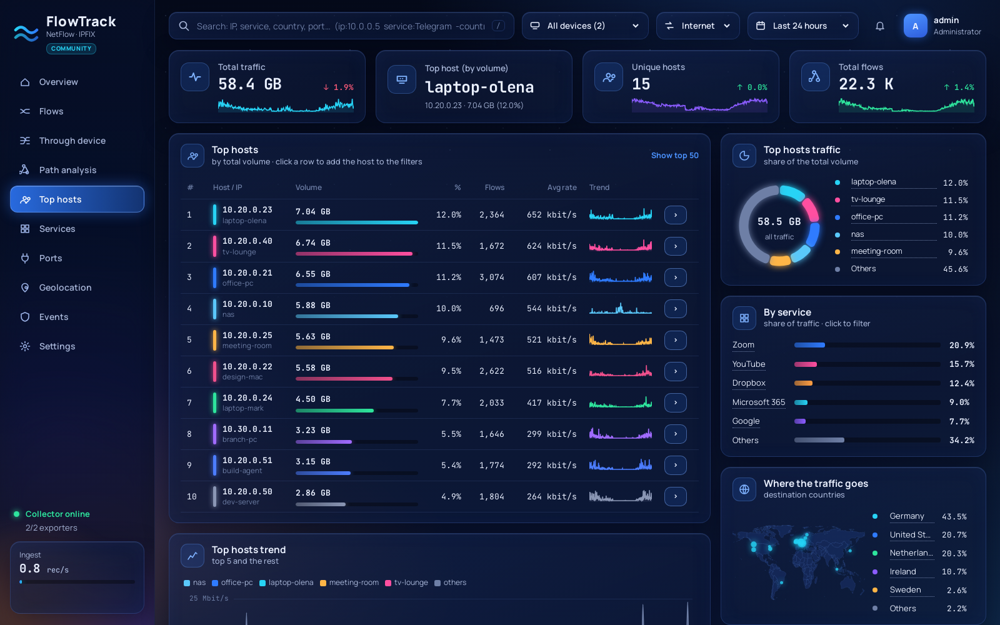
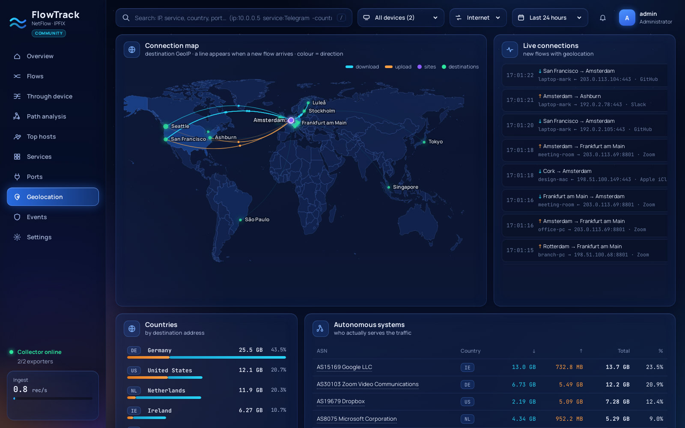
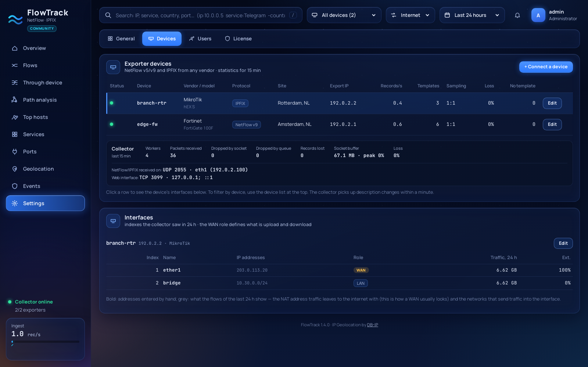

# FlowTrack

Self-hosted flow analytics for NetFlow v5/v9 and IPFIX: who talks to whom, how much, over which
service and from where, with live views, a connection map and multi-vendor exporter support.

```
exporters ── UDP 2055 ──▶ collector ──▶ ClickHouse ◀── API + web UI ── browser :3030
 FortiGate                 enrichment     raw flows 30 d
 Cisco · MikroTik          (GeoIP, ASN,   hourly usage 3 y
 Juniper · pmacct …         NAT, L7)      exporter health
```

## Screenshots

*Demo data (a small office and a branch); no real network is shown.*



| | |
|---|---|
|  **Flows** — who exchanges how much with whom; click to filter |  **Top hosts** — volume, trend, services and destinations |
|  **Geolocation** — live connection map, countries, ASNs |  **Devices** — exporters, interfaces, collector health |

## Features

**Collection**
- NetFlow v5, NetFlow v9 and IPFIX from exporters on IPv4 or IPv6 (the collector and the web
  interface listen on both). Templates are tracked per exporter and saved, so a collector restart does
  not drop the first minutes of data while waiting for the exporter to resend them.
- Correct accounting of delta counters. FortiOS (like NetFlow v9/IPFIX in general) re-exports a long
  session every `active-flow-timeout`, and each export covers only its own interval — the next export's
  `FIRST_SWITCHED` equals the previous `LAST_SWITCHED`. Traffic is therefore the plain sum of records.
- Inside/outside endpoint and direction from the exporter's WAN interfaces (leaves via WAN = upload,
  arrives via WAN = download; FortiOS interface `0` = the firewall itself), or from RFC 1918 / CGNAT
  ranges when no interfaces are configured.
- Enrichment: country, city, coordinates and ASN of the outside address
  ([DB-IP Lite](https://db-ip.com/db/lite.php), CC BY 4.0), L7 protocol from protocol + port,
  service name from ASN or port, post-NAT address, inside host names from a names file and reverse DNS.
- Sampled exporters: the sampling rate is read from the record itself, from NetFlow v9 / IPFIX options
  records, from the NetFlow v5 header, or taken from the device settings (`"sampling": "1:N"`), and bytes
  and packets are scaled up accordingly. The rate is stored with every record and shown per device.
- Exporter health: records/s, templates, packets lost (sequence gaps), records skipped while waiting
  for a template, effective sampling rate.
- Several decoding workers (`FT_WORKERS`): one receiver process only reads the socket and spreads
  packets over the workers, templates go to all of them — so even a single busy exporter uses many
  cores, and a slow database never stalls the socket.
- Collector health: packets dropped by the kernel (socket buffer full), by the worker queues, and records
  lost while ClickHouse was unreachable — shown on the Devices page and raised as an event.
- Optional raw forwarding (`FT_FORWARD`) so another collector keeps receiving the same feed.

**Web UI**
- *Overview*: KPIs with trend against the previous period, live inside ↔ outside exchange, connection
  map and 3D globe, top services, hosts, conversations, latest flows.
- *Flows*: top-10 inside × top-10 outside exchange (ribbon width = bytes, packets or flows; colour =
  direction), inspector for the selected host or conversation, protocols, raw flow records with NAT,
  ASN and interfaces.
- *Hosts*, *Services*, *Geolocation* (live arcs as flows arrive, countries, ASNs), *Events*
  (sustained upload, bursts, new countries, export loss), *Devices* (exporters and interfaces).
- Every value is a click-to-filter; filters can also be typed: `ip:10.0.0.5 service:Telegram -country:US port:443`.
- Login with two roles: **admin** (users, devices) and **viewer** (read-only).
- English and Ukrainian, switchable per browser (the user menu); the browser language picks the default.

## Quick start

```bash
curl -fsSL https://raw.githubusercontent.com/henzelis/flowtrack/main/install.sh | sudo bash
```

The installer (English or Ukrainian) installs the dependencies — Python, Docker if missing (asks
first), ClickHouse in Docker, DB-IP GeoIP databases, refreshed when a new monthly edition is out (checked daily) — then asks a few questions
with defaults: free NetFlow/IPFIX and web ports (busy ports are detected and the next free one is
offered), your exporter type, its IP and WAN interface, the admin password and whether to open the ports
in ufw/firewalld. The web interface is served over **HTTPS** with an automatically generated
self-signed certificate. It finishes with the URL, the certificate fingerprint and a ready-made exporter
configuration for your vendor.

Run the same command again to **upgrade**, **reconfigure** or **uninstall**. Unattended install:

```bash
curl -fsSL https://raw.githubusercontent.com/henzelis/flowtrack/main/install.sh | \
  sudo FT_ADMIN_PASSWORD='change-me-now' FT_VENDOR=Fortinet FT_EXPORTER_IP=192.0.2.1 bash -s -- --yes
```

Supported: Debian/Ubuntu (apt) and Fedora/RHEL/Rocky/Alma (dnf) with systemd, x86_64 or arm64. Details
are logged to `/var/log/flowtrack-install.log`. The manual steps below do the same by hand.

## Requirements

- Linux host reachable from the exporters (UDP 2055), Python 3.10+, Docker (for ClickHouse).
- Disk: measured about 22 bytes per flow record after ClickHouse compression (~4.5×), i.e. roughly
  25 MB per million records. A small office exporting ~5 records/s needs about 300 MB for the 30-day
  raw retention.

## Manual install

Run from a checkout of this repository.

```bash
# 1. Service user and directories
sudo useradd --system --no-create-home --shell /usr/sbin/nologin flowtrack
sudo mkdir -p /opt/flowtrack/clickhouse /opt/flowtrack/geoip /etc/flowtrack

# 2. ClickHouse, reachable from this host only; deploy/clickhouse-flowtrack.xml turns off the diagnostic
#    log tables (they grow by gigabytes and inflate memory use) and keeps caches small
PW=$(openssl rand -hex 16)
sudo mkdir -p /etc/flowtrack/clickhouse && sudo cp deploy/clickhouse-flowtrack.xml /etc/flowtrack/clickhouse/flowtrack.xml
docker run -d --name flowtrack-ch --restart unless-stopped -p 127.0.0.1:8123:8123 --memory 4g \
  --ulimit nofile=262144:262144 -v /opt/flowtrack/clickhouse:/var/lib/clickhouse \
  -v /etc/flowtrack/clickhouse/flowtrack.xml:/etc/clickhouse-server/config.d/flowtrack.xml:ro \
  -e CLICKHOUSE_DB=flowtrack -e CLICKHOUSE_USER=flowtrack -e CLICKHOUSE_PASSWORD=$PW \
  clickhouse/clickhouse-server:24

# 3. GeoIP databases (monthly files, free, CC BY 4.0)
M=$(date +%Y-%m)
for f in city asn; do
  curl -s https://download.db-ip.com/free/dbip-$f-lite-$M.mmdb.gz | gunzip | sudo tee /opt/flowtrack/geoip/dbip-$f.mmdb >/dev/null
done

# 4. Code and Python environment
sudo mkdir -p /opt/flowtrack/app && sudo cp -r *.py schema.sql web deploy /opt/flowtrack/app/
sudo python3 -m venv /opt/flowtrack/venv
sudo /opt/flowtrack/venv/bin/pip install netflow==0.12.2 maxminddb

# 5. Configuration
sudo cp deploy/flowtrack.env.example /etc/flowtrack/env
sudo sed -i "s/^FT_CH_PASSWORD=.*/FT_CH_PASSWORD=$PW/" /etc/flowtrack/env
sudo cp deploy/exporters.json.example /etc/flowtrack/exporters.json   # edit for your devices
sudo cp deploy/hosts.json.example /etc/flowtrack/hosts.json           # optional host names
sudo chown root:flowtrack /etc/flowtrack/env && sudo chmod 640 /etc/flowtrack/env

# 6. HTTPS certificate (self-signed; replace with your own if you have one)
sudo mkdir -p /etc/flowtrack/tls
sudo openssl req -x509 -newkey ec -pkeyopt ec_paramgen_curve:prime256v1 -nodes -days 825 -subj "/CN=$(hostname)" \
  -addext "subjectAltName=DNS:$(hostname),IP:$(hostname -I | awk '{print $1}')" \
  -keyout /etc/flowtrack/tls/key.pem -out /etc/flowtrack/tls/cert.pem
sudo chown -R root:flowtrack /etc/flowtrack/tls && sudo chmod 750 /etc/flowtrack/tls && sudo chmod 640 /etc/flowtrack/tls/key.pem

# 7. Services
sudo cp deploy/flowtrack-* /etc/systemd/system/ && sudo chmod +x /opt/flowtrack/app/deploy/geoip-update.sh
sudo systemctl daemon-reload
sudo systemctl enable --now flowtrack-collector flowtrack-web flowtrack-geoip.timer
```

Open `https://<collector>:3030` and sign in as **admin / flowtrack**. The UI keeps reminding you until
the password is changed (user menu → *Change password*). The schema is created by the collector on its
first start.

Services run as the unprivileged `flowtrack` user with a read-only system (`ProtectSystem=strict`);
users, sessions and devices added from the UI are stored in `/var/lib/flowtrack`.

## Configuration

`/etc/flowtrack/env`:

| Variable | Default | Meaning |
|---|---|---|
| `FT_BIND`, `FT_PORT` | interface of the default route, `2055` | where NetFlow/IPFIX is received: interface name(s) and/or IP address(es), comma-separated, or `0.0.0.0` for all |
| `FT_EXPORTERS` | *(empty = any)* | allowed exporter IPs, comma-separated; devices added in the UI are allowed automatically |
| `FT_FORWARD` | *(empty)* | `host:port,…` — copy every datagram unchanged to other collectors |
| `FT_WORKERS` | `auto` | decoding processes; `auto` = half the CPU threads, at most 4 |
| | | With specific interfaces, both services also answer on localhost (health checks, `ssh -L`, a local reverse proxy) and restart themselves when an interface's address changes (DHCP). |
| `FT_RCVBUF` | `33554432` | UDP receive buffer in bytes (capped by `net.core.rmem_max`, which the installer raises to 32 MB) |
| `FT_WEB_BIND`, `FT_WEB_PORT` | interface of the default route, `3030` | web UI and API, same syntax — e.g. NetFlow on the external interface, the web UI only on the internal one |
| `FT_TLS_CERT`, `FT_TLS_KEY` | `/etc/flowtrack/tls/*.pem` | HTTPS certificate and key; empty = plain HTTP |
| `FT_CH_URL`, `FT_CH_USER`, `FT_CH_PASSWORD`, `FT_CH_DB` | | ClickHouse connection |

Devices can be described in `/etc/flowtrack/exporters.json` or from the UI (*Devices → Connect
device*, admins only; the collector picks changes up within a minute):

```json
{
  "192.0.2.1": {
    "name": "fw-main", "vendor": "Fortinet", "model": "FortiGate 100F",
    "wan_ifs": [3], "local_if": 0, "public_ips": ["198.51.100.10"],
    "city": "Amsterdam", "country": "NL", "lat": 52.37, "lon": 4.9,
    "if_names": {"3": "wan1", "0": "local"}, "sampling": "1:1"
  }
}
```

`wan_ifs` are the exporter's interface indexes (`INPUT_SNMP`/`OUTPUT_SNMP`); `public_ips` mark traffic
the device itself originates; coordinates place the site on the map.

## Exporter configuration

**Which interfaces.** Enable export on every interface whose traffic you want to see: the WAN for
internet traffic, internal interfaces (LAN, VLANs, VPN tunnels) for traffic between your own networks.
Monitoring both directions (ingress and egress) is fine: when a flow is reported on the way in and again
on the way out, FlowTrack keeps one copy if the record carries the direction field (NetFlow v9
`DIRECTION` / IPFIX `flowDirection`), and the Devices page warns when an exporter sends copies that
cannot be told apart. The *Internet / Internal / All* selector in the top bar switches between internet
traffic and traffic between inside addresses.

**FortiGate (FortiOS 7.x)** — NetFlow v9, full rate:

```
config system netflow
    set active-flow-timeout 60
    config collectors
        edit 1
            set collector-ip <COLLECTOR_IP>
            set collector-port 2055
            set source-ip <FW_LAN_IP>
        next
    end
end
config system interface
    edit "wan"
        set netflow-sampler both
    next
    edit "internal"
        set netflow-sampler both
    next
end
```

`active-flow-timeout` defaults to 30 minutes; at 60 s long sessions show up in near real time. Interface
indexes: `show system interface <name> | grep snmp-index`. FortiOS exports per session, so a session that
crosses two sampled interfaces is still reported once. Wi-Fi SSID (VAP) interfaces cannot be sampled:
traffic between two SSIDs is not visible; traffic between an SSID and a sampled interface is.
FortiOS starts exporting sessions created after the sampler was enabled.

**Cisco IOS-XE** (Flexible NetFlow) — a record with `flow direction`, so egress copies can be removed:

```
flow record FT-REC
 match ipv4 source address
 match ipv4 destination address
 match ipv4 protocol
 match transport source-port
 match transport destination-port
 match interface input
 match flow direction
 collect interface output
 collect counter bytes long
 collect counter packets long
 collect timestamp sys-uptime first
 collect timestamp sys-uptime last
flow exporter FLOWTRACK
 destination <COLLECTOR_IP>
 transport udp 2055
 template data timeout 60
flow monitor FT-MON
 exporter FLOWTRACK
 record FT-REC
 cache timeout active 60
interface GigabitEthernet0/0/0
 ip flow monitor FT-MON input
 ip flow monitor FT-MON output
interface GigabitEthernet0/0/1
 ip flow monitor FT-MON input
 ip flow monitor FT-MON output
```

**MikroTik RouterOS 7**

```
/ip traffic-flow set enabled=yes interfaces=all active-flow-timeout=1m
/ip traffic-flow target add dst-address=<COLLECTOR_IP> port=2055 version=ipfix
```

**Juniper**, **pmacct / Linux** and others: the *Connect device* dialog in the UI shows ready-made
snippets.

## Security notes

- Passwords are stored as scrypt hashes with per-user salt; only SHA-256 digests of session tokens are
  stored. Sessions use an `HttpOnly`, `SameSite=Strict` cookie and expire after 7 days of inactivity.
- Five failed logins from one address within five minutes block further attempts for a while.
- Roles are enforced by the API, not only hidden in the UI.
- The web interface is HTTPS-only (TLS 1.2+). Plain `http://` on the same port is redirected to
  `https://`, and the session cookie is marked `Secure`. The installer creates a self-signed certificate
  (ECDSA P-256, valid 825 days, all host addresses in SAN) and renews it on upgrade when it expires
  within 30 days. Browsers warn about self-signed certificates once — compare the SHA-256 fingerprint
  the installer prints. To use your own certificate, place it at `/etc/flowtrack/tls/cert.pem` and
  `key.pem` (readable by group `flowtrack`) and restart `flowtrack-web`; the installer keeps it.
  `FT_TLS=no` at install time keeps plain HTTP (e.g. behind a TLS reverse proxy — then set
  `X-Forwarded-Proto: https` there).
- ClickHouse listens on `127.0.0.1` only; user filters reach it as bound query parameters.

## API

JSON over HTTP, same session cookie as the UI. Read endpoints take `range` (`1h`, `6h`, `24h`, `7d`,
`30d`) and `f` (JSON list of `{"k": …, "v": …, "neg": bool}` filters; keys `ip`, `dst`, `service`, `l7`,
`country`, `city`, `port`, `device`, `asn`, `dir`, `proto`).

| Endpoint | Returns |
|---|---|
| `GET /api/summary` | totals for the period and the previous one |
| `GET /api/series?by=` | time series, optionally split by `service`, `int_ip`, … |
| `GET /api/top?dim=` | top-N by `int_ip`, `ext_ip`, `conv`, `service`, `l7`, `country`, `city`, `asn`, `ext_port`, `exporter` |
| `GET /api/river` | top inside × top outside links (live 2-minute window or whole period) |
| `GET /api/flows`, `GET /api/live?since=` | raw records; records newer than a timestamp |
| `GET /api/geo`, `GET /api/host?ip=` | per-city aggregates; one host's details |
| `GET /api/devices`, `GET /api/alerts`, `GET /api/meta` | exporters and interfaces; detections; metadata |
| `POST /api/login`, `/api/logout`, `/api/me/password` | session and own password |
| `GET/POST /api/users…`, `POST /api/devices/save`, `/api/devices/delete` | admin only |

## Performance

Measured on an AMD Ryzen 7 5700X (8 cores / 16 threads, ClickHouse on the same machine) with real FortiGate
NetFlow v9 packets offered for 15 s, counting what was stored after the queues drained:

| Workers | Offered load | Stored | Lost |
|---|---|---|---|
| 1 | 41,600 records/s | 100 % (catches up ~10 s after the burst) | 0 |
| 4 | 83,300 records/s | 100 % (keeps up) | 0 |
| 4 | 125,000 records/s | 93 % | 7 % dropped at the worker queues, counted and reported |

One worker decodes and enriches about **30,000 records per second** on one core; the receiver itself needs about a
quarter of a core at 125,000 records/s. For scale: a small office firewall exports a few records per
second, a busy 1 Gbit/s internet edge typically a few thousand. If the Devices page reports drops, raise
`FT_WORKERS` or use sampling on the exporter.

## Roadmap

**Next — scale and reach**
- Automated tests and CI (GitHub Actions), API tokens for scripts and monitoring

**Features**
- Notifications: Telegram, e-mail, webhook
- Host names from DHCP leases (FortiGate API) and SNMP interface names / counter cross-checks
- sFlow v5
- FortiGate application names from `APPLICATION_TAG`
- Detections: port scans, IP reputation lists
- Scheduled reports; configurable retention; ClickHouse backups

## Repository layout

| Path | What it is |
|---|---|
| `collector.py` | NetFlow v5/v9 + IPFIX listener, enrichment, batched inserts into ClickHouse |
| `api.py`, `auth.py` | JSON API, users and sessions, static web server |
| `common.py`, `schema.sql` | ClickHouse client, GeoIP/ASN/service enrichment; database schema |
| `web/` | the web UI (plain HTML/CSS/JS, ECharts vendored — no build step) |
| `deploy/` | systemd units, GeoIP refresh, configuration examples |
| `install.sh` | the one-line installer |

## License

MIT — see [LICENSE](LICENSE). IP geolocation by [DB-IP](https://db-ip.com), licensed under CC BY 4.0.
